# Swift Portfolio
Welcome to my Swift Portfolio. My iOS app projects can be found below.

## Care Capsule: AI Powered Elder Care Assistant
Care Capsule is a SwiftUI app built for the 2024 Swift Student Challenge that is a comprehensive healthcare companion app designed to assist elderly users by providing easily accessible care through their mobile devices. Built with SwiftUI and Swift Concurrency, the app features an AI-driven assistant chatbot, medication scheduling and task tracking, support resources tailored for seniors, and personal contacts, memories, and log management systems, featuring custom components, with local persistent SwiftData datastore.

The application showcases advanced machine learning integration, evolving from a CreateML sentiment classifier in version 1 to a sophisticated fine-tuned OpenAI GPT model for version 2. This AI assistant provides conversational companionship while intelligently parsing natural language to set up medication schedules, tasks, memories, contacts, and logs through structured JSON responses. A custom Python backend deployed on AWS EC2 powers secure APIs, background processing, and scalable infrastructure.

Accessibility and inclusive design were largely considered while developing Care Capsule, featuring AVSpeechSynthesizer for text-to-speech, SFSpeechRecognizer for voice input, VoiceOver support, Voice Control integration, and dynamic text scaling for enhanced usability among elderly users. Core iOS frameworks include CLLocationManager for emergency contact location sharing, UNUserNotificationCenter for medication reminders, MessageUI for healthcare provider communication, Keychain Services for secure data storage, and SwiftData with local document directory persistence for offline functionality.

Additional features include UIDocumentPicker and PHPickerViewController for schedule history for checked and skipped medication document capture and contact integration, WatchKit support, background refresh capabilities, and time zone-aware scheduling. This elder-focused healthcare solution demonstrates enterprise-grade iOS development with machine learning, backend integration, accessibility compliance, and validation, creating a comprehensive digital care ecosystem for aging populations.

### Artificial Intelligence Chat - Conversational, Log, Medication and Task Set Up

	&nbsp;&nbsp;&nbsp;&nbsp;&nbsp;
	&nbsp;&nbsp;&nbsp;&nbsp;&nbsp;
	&nbsp;&nbsp;&nbsp;&nbsp;&nbsp;
 	&nbsp;&nbsp;&nbsp;&nbsp;&nbsp;
	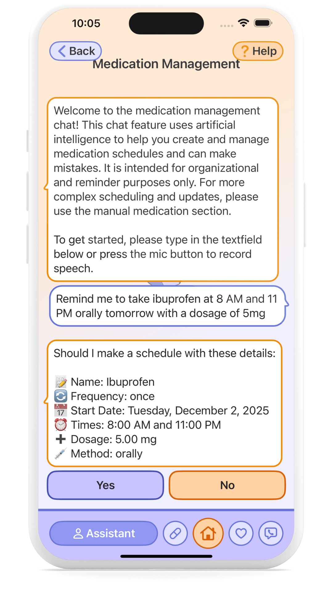&nbsp;&nbsp;&nbsp;&nbsp;&nbsp;
 	&nbsp;&nbsp;&nbsp;&nbsp;&nbsp;

### Dashboard and Notifications

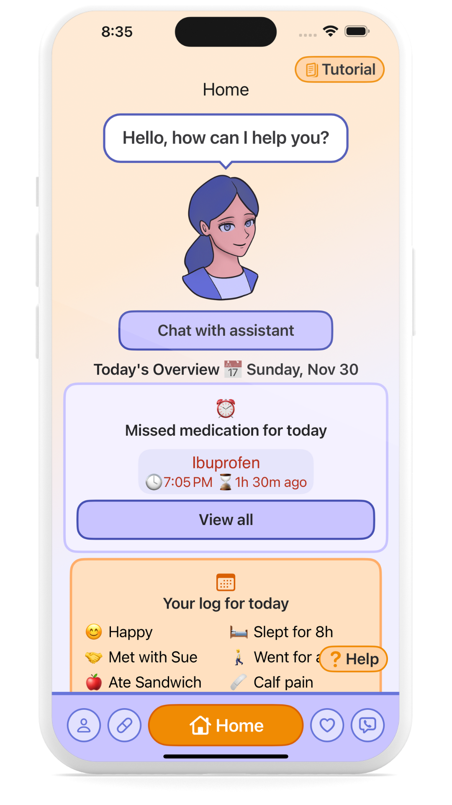&nbsp;&nbsp;&nbsp;&nbsp;&nbsp;
&nbsp;&nbsp;&nbsp;&nbsp;&nbsp;
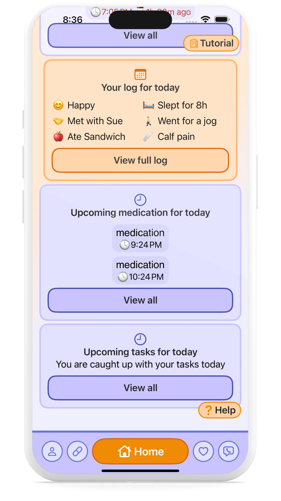&nbsp;&nbsp;&nbsp;&nbsp;&nbsp;

### Medication Scheduling, History, and Sharing Section

&nbsp;&nbsp;&nbsp;&nbsp;&nbsp;
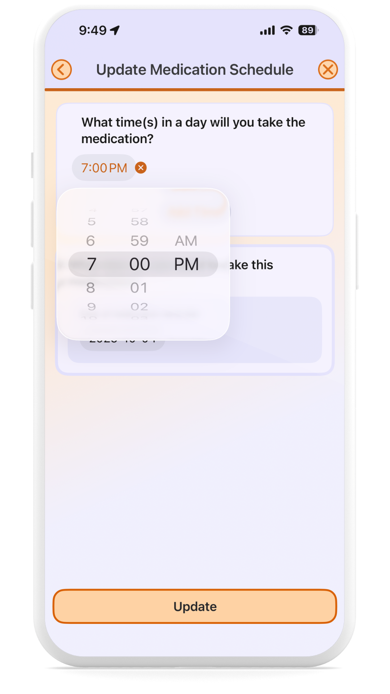&nbsp;&nbsp;&nbsp;&nbsp;&nbsp;
&nbsp;&nbsp;&nbsp;&nbsp;&nbsp;
&nbsp;&nbsp;&nbsp;&nbsp;&nbsp;
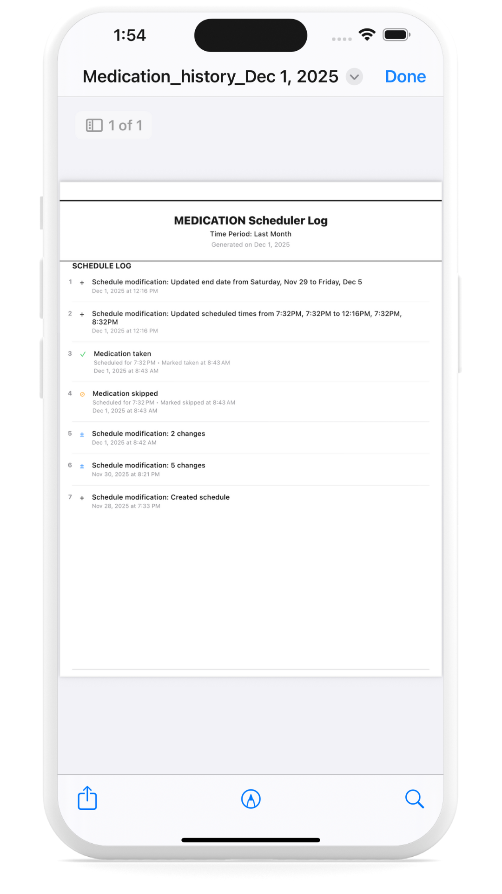&nbsp;&nbsp;&nbsp;&nbsp;&nbsp;

### Reminders Section

&nbsp;&nbsp;&nbsp;&nbsp;&nbsp;
&nbsp;&nbsp;&nbsp;&nbsp;&nbsp;
&nbsp;&nbsp;&nbsp;&nbsp;&nbsp;

### Log Section

&nbsp;&nbsp;&nbsp;&nbsp;&nbsp;
&nbsp;&nbsp;&nbsp;&nbsp;&nbsp;
&nbsp;&nbsp;&nbsp;&nbsp;&nbsp;

### Contacts, Memories, and Resources Sections

&nbsp;&nbsp;&nbsp;&nbsp;&nbsp;
&nbsp;&nbsp;&nbsp;&nbsp;&nbsp;
&nbsp;&nbsp;&nbsp;&nbsp;&nbsp;
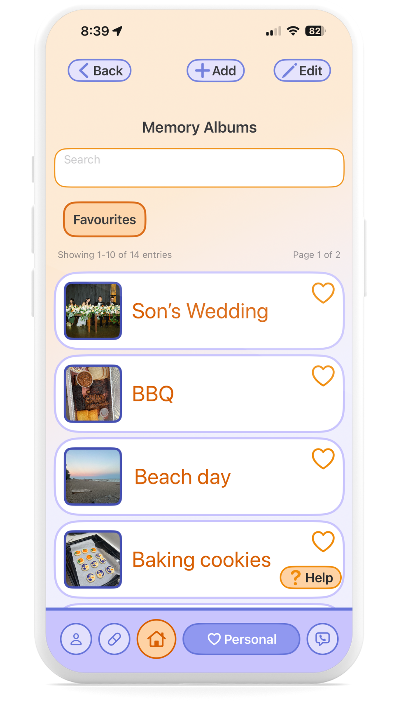&nbsp;&nbsp;&nbsp;&nbsp;&nbsp;
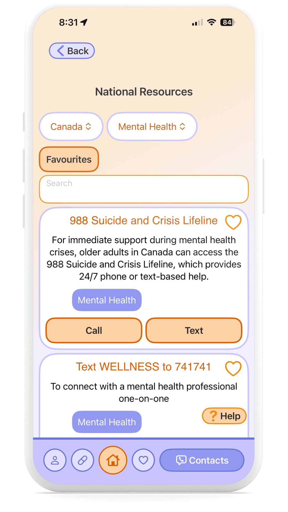&nbsp;&nbsp;&nbsp;&nbsp;&nbsp;

### Accessibility and Help

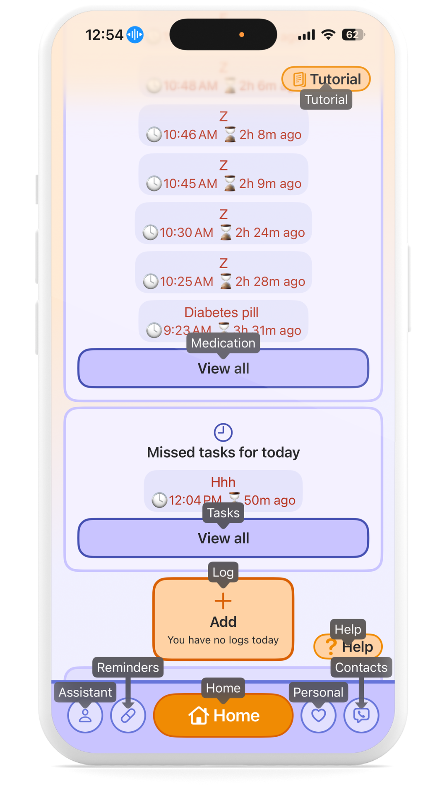&nbsp;&nbsp;&nbsp;&nbsp;&nbsp;
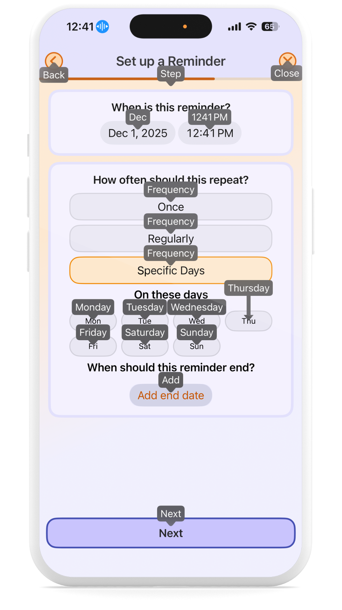&nbsp;&nbsp;&nbsp;&nbsp;&nbsp;
&nbsp;&nbsp;&nbsp;&nbsp;&nbsp;
&nbsp;&nbsp;&nbsp;&nbsp;&nbsp;
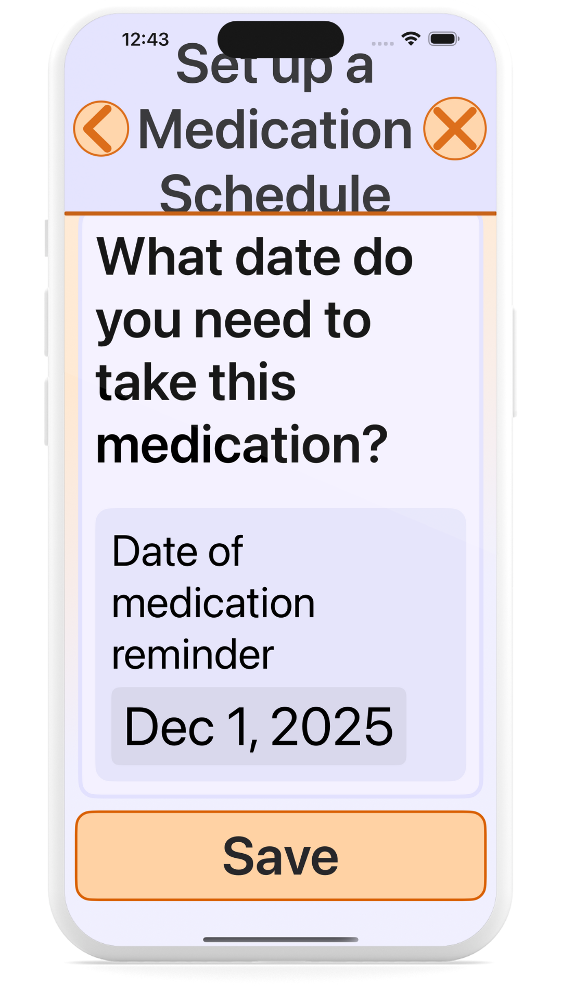&nbsp;&nbsp;&nbsp;&nbsp;&nbsp;
&nbsp;&nbsp;&nbsp;&nbsp;&nbsp;
&nbsp;&nbsp;&nbsp;&nbsp;&nbsp;

## Expoji: A Cosplay Social Media
Expoji is a SwiftUI social media app in progress designed for cosplayers, using Firebase Authentication for secure user sign-in and account management. Users will be able to create profiles, share their cosplays, and view others' creations through a dynamic community feed, with search and discovery functionality to find cosplays by characters or series, with Cloud Firestore as the backend. Expoji was built with Xcode and written in Swift 5X. The app was created using SwiftUI. 

	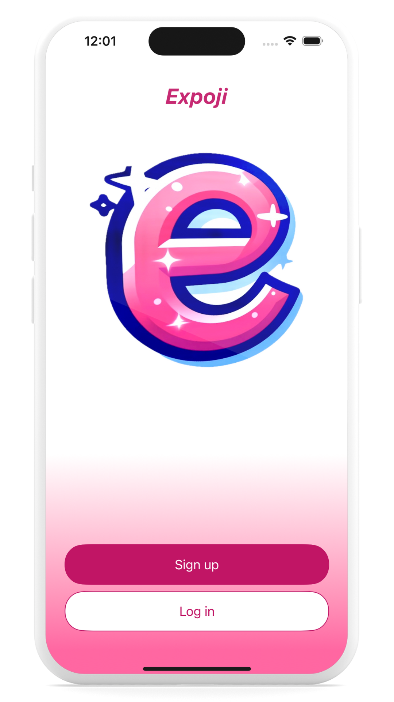&nbsp;&nbsp;&nbsp;&nbsp;&nbsp;
	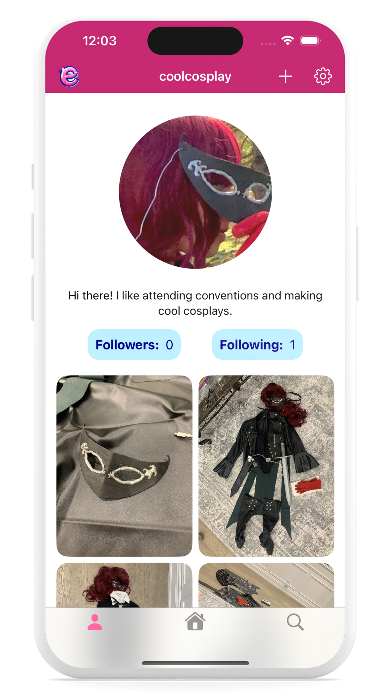&nbsp;&nbsp;&nbsp;&nbsp;&nbsp;
	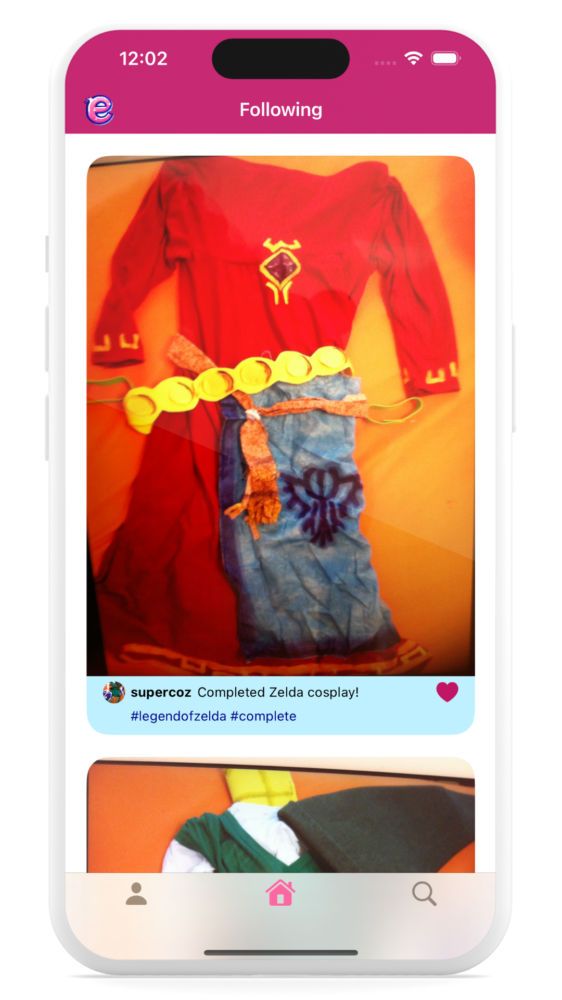&nbsp;&nbsp;&nbsp;&nbsp;&nbsp;
	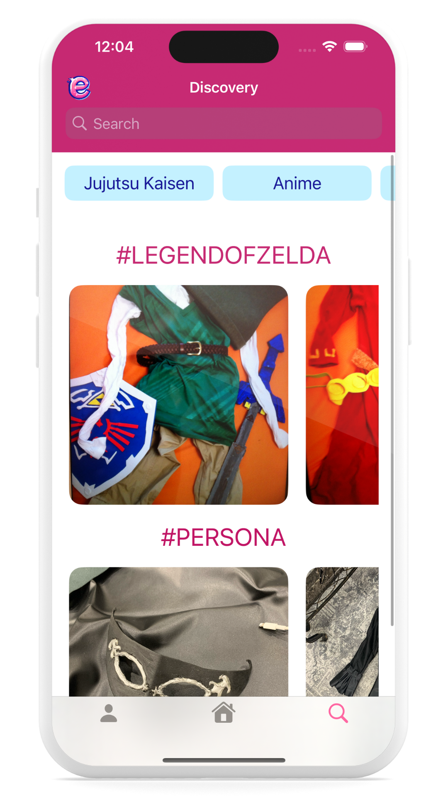&nbsp;&nbsp;&nbsp;&nbsp;&nbsp;
 	&nbsp;&nbsp;&nbsp;&nbsp;&nbsp;

## Wordaurus
Wordaurus is an iOS game app I created where the user has to guess any synonym to the word that appears on the screen. The synonyms were generated with the word as a parameter and generating possible symptoms using the [English synonyms API](https://rapidapi.com/ericmorvax-2YHUl-ynmUD/api/english-synonyms) by Eric Marvin. I used NSUserDefaults to keep track of the player’s score and to display the player’s high score. I used the [ConfettiView](https://cocoapods.org/pods/ConfettiView) CocoaPod by Or Ron to add confetti when the score page appears. This app was fun to create and to play. Wordaurus was built with Xcode and written in Swift 5X. The design was created using Storyboard and Auto Layout. 

	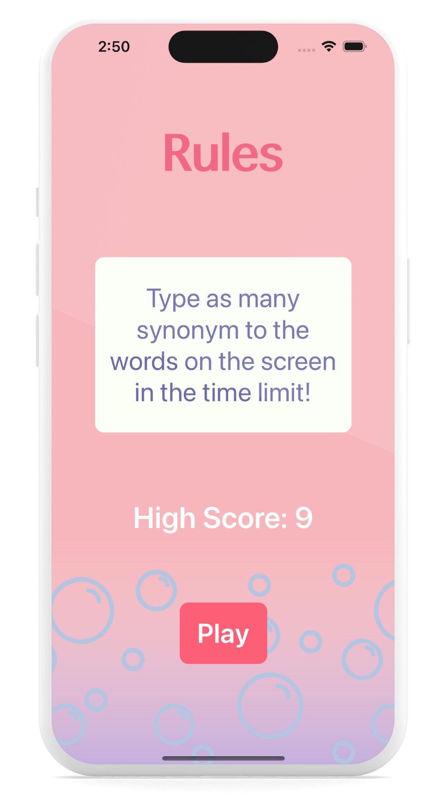&nbsp;&nbsp;&nbsp;&nbsp;&nbsp;
	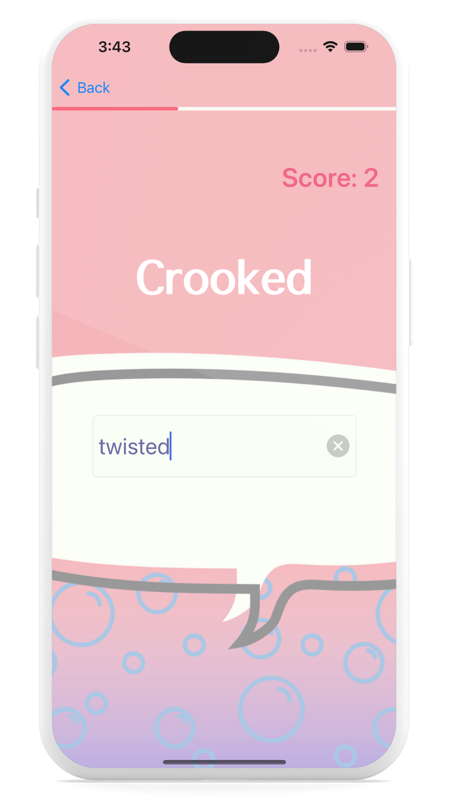&nbsp;&nbsp;&nbsp;&nbsp;&nbsp;
 	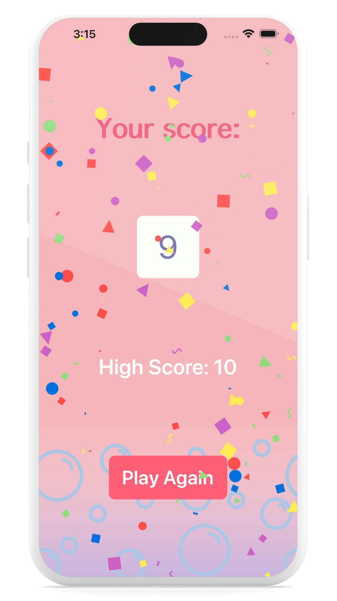&nbsp;&nbsp;&nbsp;&nbsp;&nbsp;
	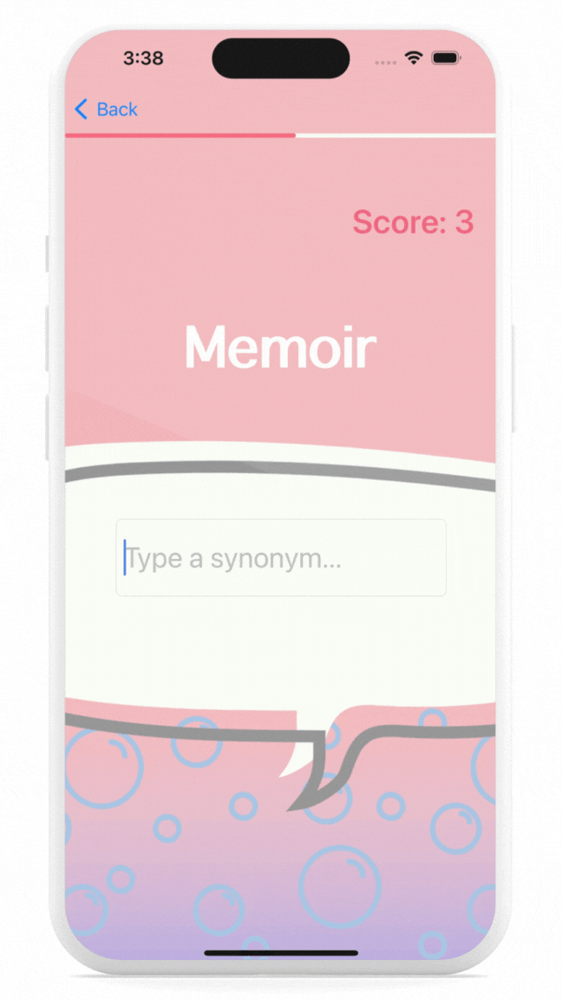&nbsp;&nbsp;&nbsp;&nbsp;&nbsp;

## TierAnime
TierAnime is an iOS app project I created that allows the user to search, save, and rate Animes and view their description, images, and genres. This data was generated using the [Anime DB Api by BrianRofiq](https://rapidapi.com/brian.rofiq/api/anime-db). The Anime information is displayed using table views. I used Cloud Firestore for data persistence to keep the user’s saved Animes and their ratings. I used the [AARatingBar](https://cocoapods.org/pods/AARatingBar) CocoaPod by Engr. Ahsan Ali to add a rating bar for users to rate their Anime, which will then sort the anime by highest to lowest rating.TierAnime was built with Xcode and written in Swift 5X. The design was created using Storyboard and Auto Layout.             

	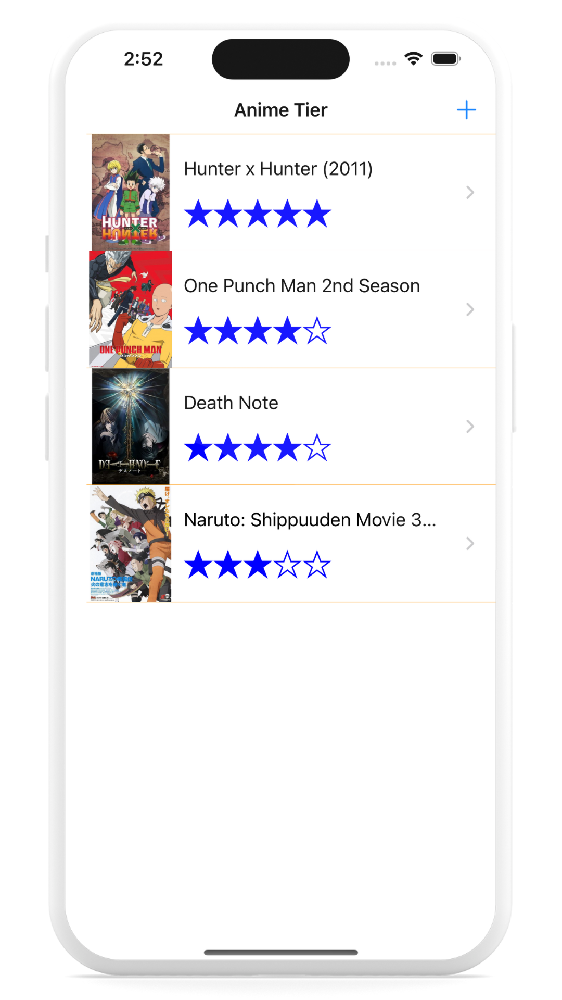&nbsp;&nbsp;&nbsp;&nbsp;&nbsp;
	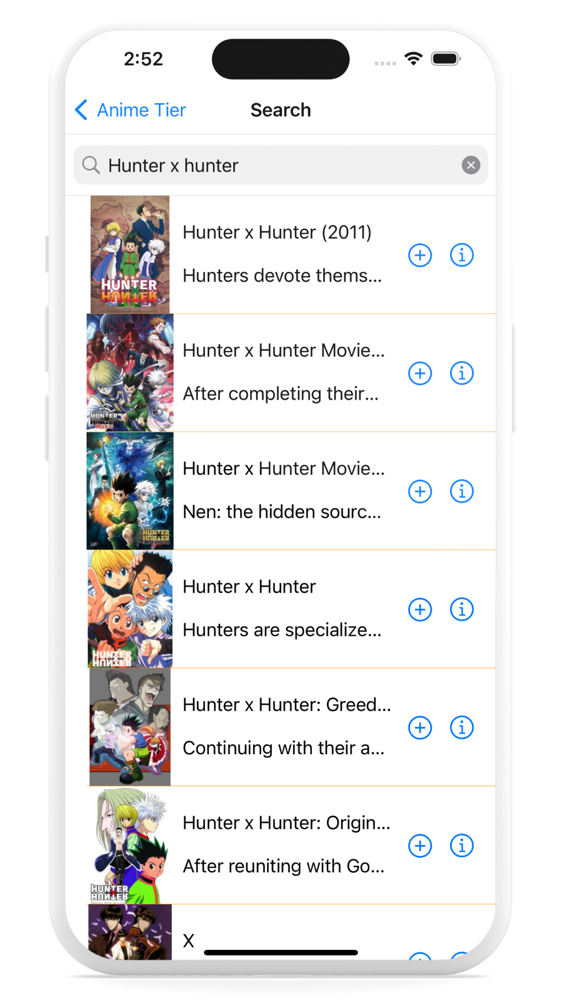&nbsp;&nbsp;&nbsp;&nbsp;&nbsp;
 	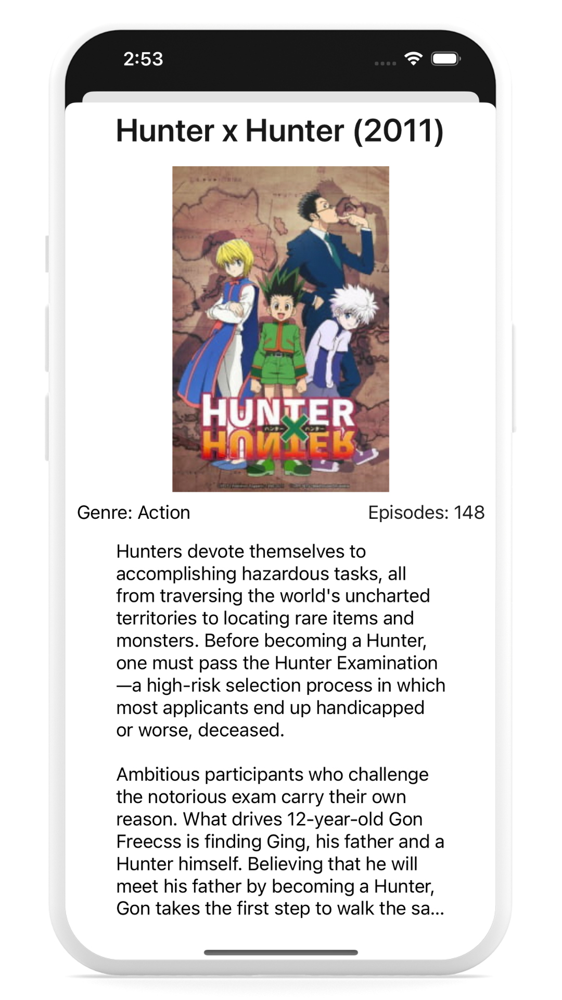&nbsp;&nbsp;&nbsp;&nbsp;&nbsp;
	&nbsp;&nbsp;&nbsp;&nbsp;&nbsp;

   
## Fruitsonality
Fruitsonality is my first completed iOS app project. The user is given a scenario with multiple prompts in which they can choose how to react to the scenario by clicking their choice. Depending on their choices, they are presented a fruit at the end of the quiz of their fruit personality. Fruitsonality was built with Xcode and written entirely in Swift 5X. The design was created using Storyboard and Auto Layout.

	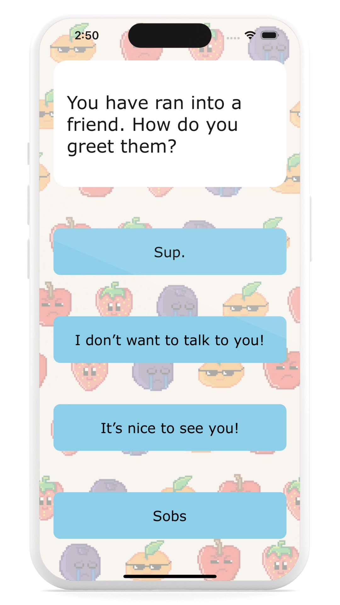&nbsp;&nbsp;&nbsp;&nbsp;&nbsp;
	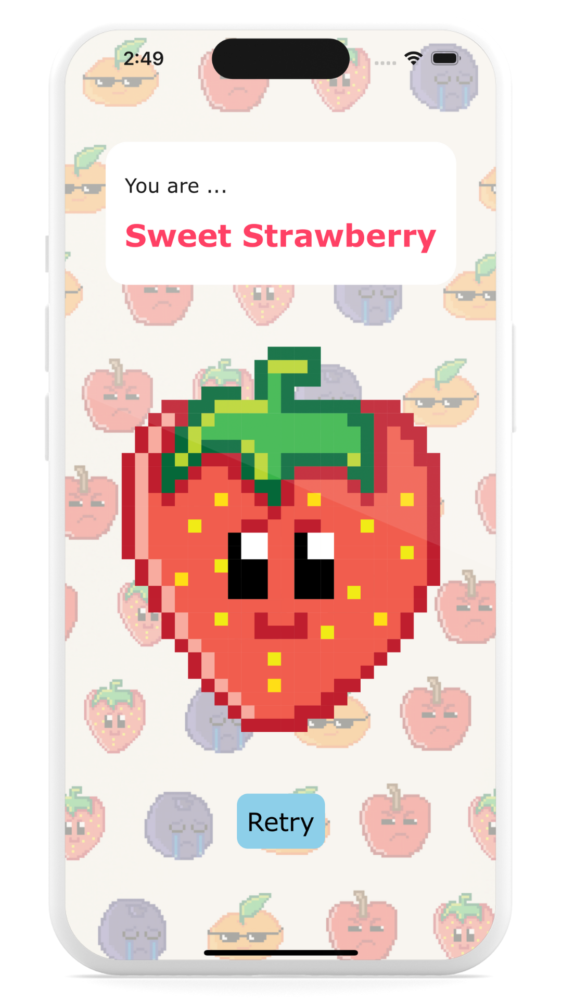&nbsp;&nbsp;&nbsp;&nbsp;&nbsp;
 	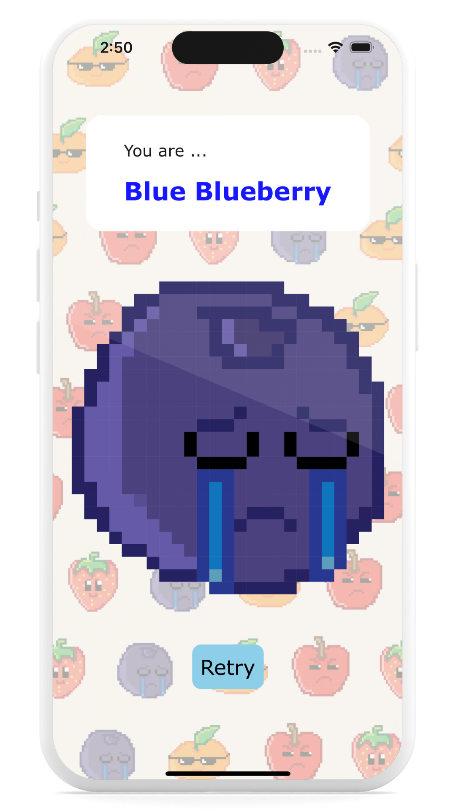&nbsp;&nbsp;&nbsp;&nbsp;&nbsp;
	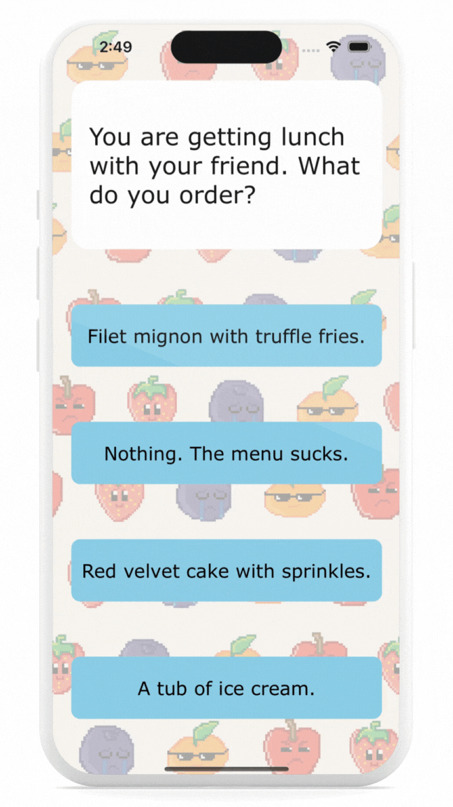&nbsp;&nbsp;&nbsp;&nbsp;&nbsp;

                                                                                       
