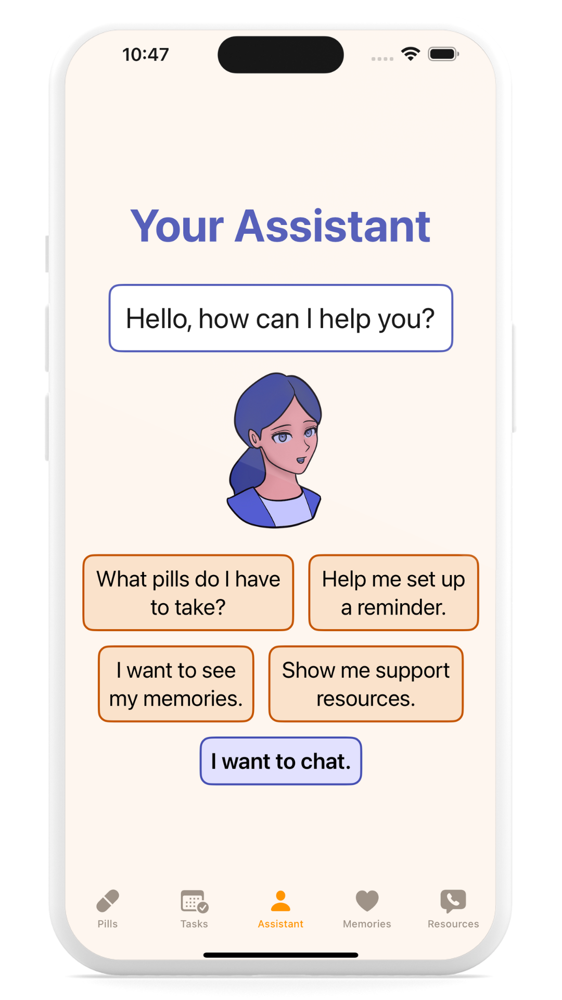
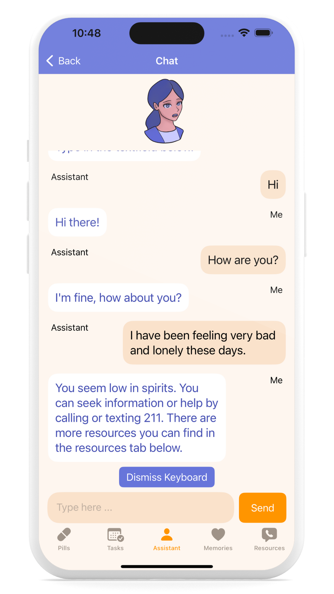
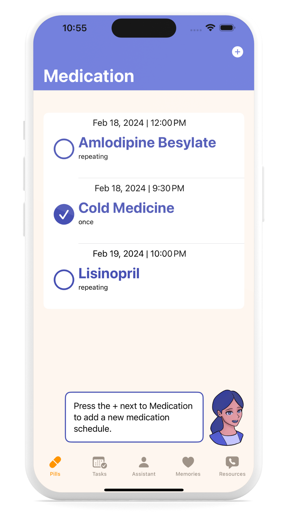
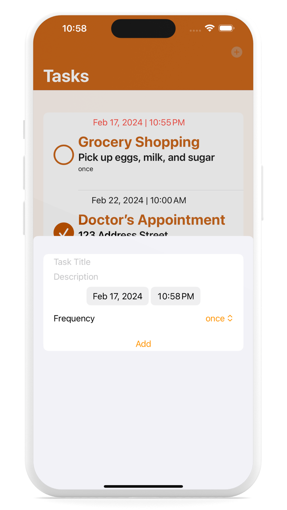
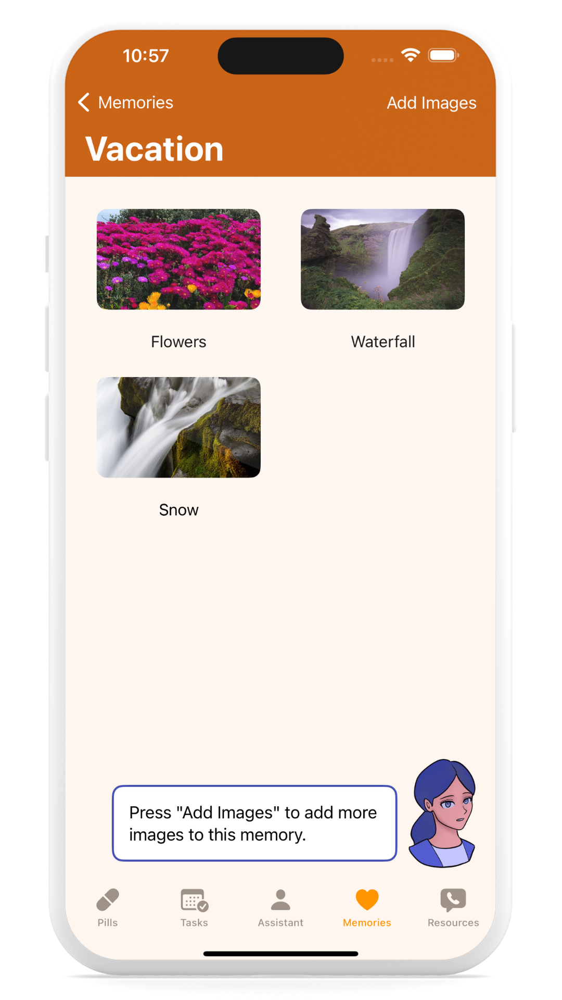
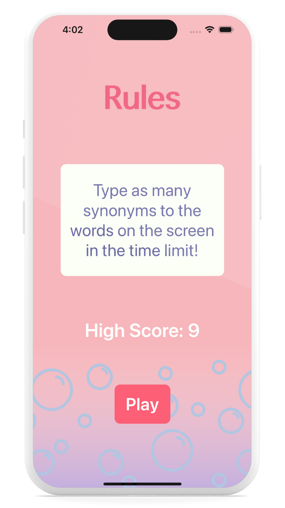

# Swift Portfolio
Hello, thank you for viewing my swift portfolio. My iOS projects can be found below.

## CareCapsule
Care Capsule is a SwiftUI app built for the 2024 Swift Student Challenge that’s purpose is to assist the lives of the elderly, by providing easily accessible care from their mobile device. Care Capsule allows users to keep track of their medication schedule, monitor their tasks and appointments, provides companionship through a logic and machine learning based chatbot that also attempts to read and track their mental health through sentiment analysis, allows users to make a collection of positive memories to look back on, and provides mental health resources catered to older adults. 
I used several resources and apple technologies. For the assistant, I used AVSpeechSynthesizer for text to speech for improved accessibility by having it explain how to use the app sections and to speak chat responses out loud. The chatbot portion incorporates CreateML’s sentiment analysis, using the [Mental Health Corpus dataset](https://www.kaggle.com/datasets/reihanenamdari/mental-health-corpus/data) by Reihaneh Namdari to train the model to determine if a message shows signs of low mental health.  The medication schedules, tasks, and memories are persisted locally using SwiftData and the documents directory.

CareCapsule was built with Xcode Playgrounds and written in Swift 5X. The design was created using SwiftUI. 

	&nbsp;&nbsp;&nbsp;&nbsp;&nbsp;
	&nbsp;&nbsp;&nbsp;&nbsp;&nbsp;
	&nbsp;&nbsp;&nbsp;&nbsp;&nbsp;
 	&nbsp;&nbsp;&nbsp;&nbsp;&nbsp;
	&nbsp;&nbsp;&nbsp;&nbsp;&nbsp;
 	&nbsp;&nbsp;&nbsp;&nbsp;&nbsp;

## Wordaurus
Wordaurus is an iOS game app I created where the user has to guess any synonym to the word that appears on the screen. The synonyms were generated with the word as a parameter and generating possible symptoms using the [English synonyms API](https://rapidapi.com/ericmorvax-2YHUl-ynmUD/api/english-synonyms) by Eric Marvin. I used NSUserDefaults to keep track of the player’s score and to display the player’s high score. I used the [ConfettiView](https://cocoapods.org/pods/ConfettiView) CocoaPod by Or Ron to add confetti when the score page appears. This app was fun to create and to play.

Wordaurus was built with Xcode and written in Swift 5X. The design was created using Storyboard and Auto Layout.  You can view the code [here](https://github.com/elenagalluzzo/Wordaurus).  

	&nbsp;&nbsp;&nbsp;&nbsp;&nbsp;
	&nbsp;&nbsp;&nbsp;&nbsp;&nbsp;
 	&nbsp;&nbsp;&nbsp;&nbsp;&nbsp;
	&nbsp;&nbsp;&nbsp;&nbsp;&nbsp;

## TierAnime
TierAnime is an iOS app project I created that allows the user to search, save, and rate Animes and view their description, images, and genres. This data was generated using the [Anime DB Api by BrianRofiq](https://rapidapi.com/brian.rofiq/api/anime-db). The Anime information is displayed using table views. I used Cloud Firestore for data persistence to keep the user’s saved Animes and their ratings. I used the [AARatingBar](https://cocoapods.org/pods/AARatingBar) CocoaPod by Engr. Ahsan Ali to add a rating bar for users to rate their Anime, which will then sort the anime by highest to lowest rating.

TierAnime was built with Xcode and written in Swift 5X. The design was created using Storyboard and Auto Layout. You can view the code [here](https://github.com/elenagalluzzo/TierAnime).                                                                                   

	&nbsp;&nbsp;&nbsp;&nbsp;&nbsp;
	&nbsp;&nbsp;&nbsp;&nbsp;&nbsp;
 	&nbsp;&nbsp;&nbsp;&nbsp;&nbsp;
	&nbsp;&nbsp;&nbsp;&nbsp;&nbsp;

   
## Fruitsonality
Fruitsonality is my first completed iOS app project. The user is given a scenario with multiple prompts in which they can choose how to react to the scenario by clicking their choice. Depending on their choices, they are presented a fruit at the end of the quiz of their fruit personality. Fruitsonality was loosely based on the take home project Destini from Dr. Angela Yu’s [The Complete iOS App Development Bootcamp](https://www.udemy.com/course/ios-13-app-development-bootcamp/).

Fruitsonality was built with Xcode and written entirely in Swift 5X. The design was created using Storyboard and Auto Layout. You can view the code [here](https://github.com/elenagalluzzo/fruitsonality).

	&nbsp;&nbsp;&nbsp;&nbsp;&nbsp;
	&nbsp;&nbsp;&nbsp;&nbsp;&nbsp;
 	&nbsp;&nbsp;&nbsp;&nbsp;&nbsp;
	&nbsp;&nbsp;&nbsp;&nbsp;&nbsp;

                                                                                       
